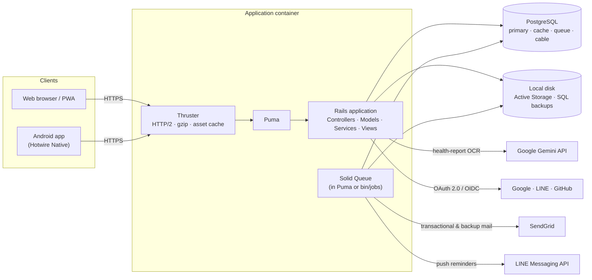
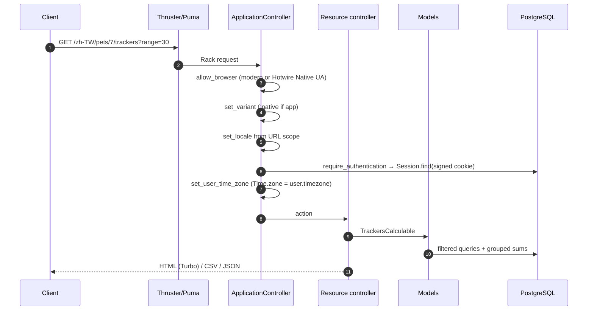
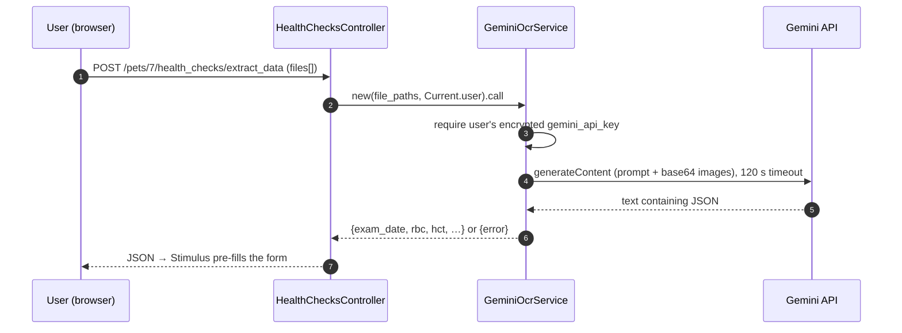
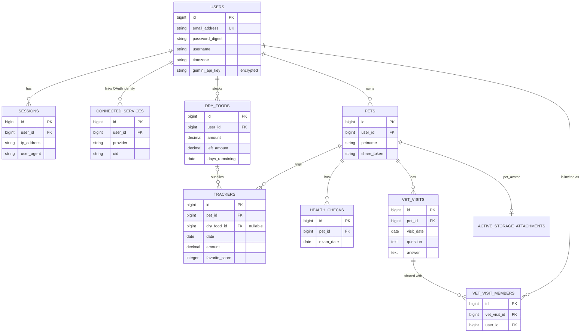
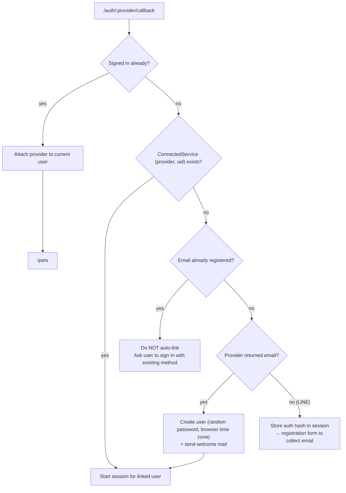
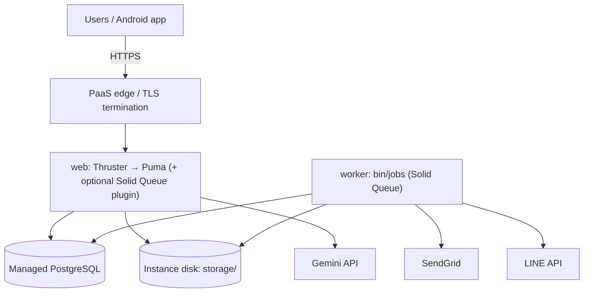

# Pet Tracker v4 — Architecture Design Document

| Item | Value |
|---|---|
| Document version | 1.12 (S1–S3 and S5–S14 fixed; S4 fixed in code, operator steps pending; feed-time ordering fixed) |
| Date | 2026-09-13 |
| Source baseline | `main` @ `4d33dcc` |
| Application | Pet Tracker v4 (Rails 8.1 monolith + Hotwire Native Android shell) |
| Audience | Developers, reviewers, and operators of the application |

> This document describes the system **as it is implemented today** and, where the current implementation falls short of the recommended design, flags the gap with ⚠️ and a recommendation. File references use `path:line`.

---

## Table of Contents

1. [System Architecture Overview](#1-system-architecture-overview)
2. [API Endpoint Design](#2-api-endpoint-design)
3. [Database Schema](#3-database-schema)
4. [Security Design](#4-security-design)
5. [Deployment and Scaling Recommendations](#5-deployment-and-scaling-recommendations)
6. [Appendix](#6-appendix)

---

## 1. System Architecture Overview

### 1.1 Purpose and Scope

Pet Tracker v4 is a web application for pet owners to record and analyze:

- **Daily feeding** (trackers): what was served, how much was left, how eager the pet was, and weight.
- **Food inventory** (dry foods): bag stock, average daily consumption, and predicted run-out date.
- **Health checks**: blood-panel results, optionally extracted from photos with Google Gemini.
- **Vet visits**: questions prepared in advance, answers recorded afterwards, and visit metadata such as purpose and waiting versus consultation time.
- **Sharing**: a public read-only feeding dashboard (share token) and per-visit collaboration with other registered users.

### 1.2 Architectural Style

The system is a **server-rendered Rails monolith** following the classic **MVC** pattern and the **Hotwire ("HTML over the wire")** approach:

- The server renders HTML (ERB + Tailwind). **Turbo** handles navigation and form submission without full page reloads, and **Stimulus** controllers add small, focused client behavior.
- The same HTML serves three clients: desktop browsers, mobile browsers (installable as a PWA), and an **Android app** (`pet_tracker_android/`) built on **Hotwire Native**. The server detects the native app through its User-Agent and switches to a `:native` view variant (`app/controllers/application_controller.rb`).
- JSON responses exist for a subset of actions (see §2) and CSV is used for import and export. There is no separate public API.
- Background work, caching, and WebSocket pub/sub all run on PostgreSQL through the **Solid** trio (Solid Queue, Solid Cache, and Solid Cable), so Redis is not required.

### 1.3 Technology Stack

| Layer | Technology |
|---|---|
| Language / runtime | Ruby 3.4.1, jemalloc |
| Web framework | Rails 8.1.3.1 |
| App server / proxy | Puma, fronted by **Thruster** (HTTP/2, compression, asset caching) |
| Front end | Turbo, Stimulus (14 controllers), Importmap, Tailwind CSS 3, Chartkick + Groupdate (charts), will_paginate |
| i18n | `rails-i18n`, `i18n-js` (translations exported to `app/javascript/translations.js` for Stimulus); locales: `en` (default), `zh-TW`, `ja` |
| Database | PostgreSQL (production), SQLite (development/test) |
| Background jobs | Solid Queue (in-Puma plugin or `bin/jobs` worker), recurring schedule in `config/recurring.yml` |
| Cache / pub-sub | Solid Cache, Solid Cable |
| File storage | Active Storage (local disk) + `image_processing`/libvips |
| Authentication | `has_secure_password` (bcrypt), DB-backed sessions, OmniAuth (Google, LINE, GitHub) |
| External services | Google Gemini API (OCR), Gmail API or SendGrid (email), LINE Messaging API (push) |
| Mobile | Android app on Hotwire Native 1.2.6 |
| Packaging / CI | Docker (multi-stage), Kamal (template only), GitHub Actions (Brakeman, importmap audit, RuboCop, tests) |

### 1.4 High-Level Architecture



### 1.5 Component Responsibilities

| Component | Location | Responsibility |
|---|---|---|
| **Controllers** | `app/controllers/` | HTTP handling, strong parameters, rendering and redirects. One controller per resource (`pets`, `trackers`, `health_checks`, `vet_visits`, `dry_foods`, `users`, `sessions`, `registrations`, `passwords`, `shared_trackers`, `timezones`, `pages`, `omni_auth/sessions`). |
| **Controller concerns** | `app/controllers/concerns/` | `Authentication` (session cookie, `require_authentication`, `start_new_session_for`), and `TrackersCalculable` (date-range filtering, chart series, and the hotel/boarding split, shared by the private and public tracker views). |
| **Models** | `app/models/` | Validations, enums, associations, and domain callbacks: dry-food inventory sync, share links (on, replace, expire, off), vet-visit metadata sync, and `answered_date` stamping. `Current` holds the request-scoped session and user. |
| **Services** | `app/services/` | `CsvImportTrackersService` (transactional CSV import), `GeminiOcrService` (image → lab values JSON), `NotificationService` (LINE push or email fallback). |
| **Jobs** | `app/jobs/` | `PetWeightReminderJob`, `UserBackupJob`. |
| **Mailers** | `app/mailers/` | Welcome, password reset, weight reminder, CSV backup (delivered through SendGrid). |
| **Views** | `app/views/` | ERB + Tailwind HTML, Jbuilder JSON, `:native` variants, PWA manifest. |
| **Stimulus** | `app/javascript/controllers/` | Form helpers (`tracker_form`, `left_amount`, `range_form`, `filter_form`), bulk edit and delete, OCR upload, share/download bridge, time-zone detection, toasts. |
| **Rake tasks** | `lib/tasks/` | `db:backup`, `notifications:weigh_pets`, `i18n:export` (hooked into `assets:precompile`), and a custom `tailwindcss:build`. |

### 1.6 Request Lifecycle (authenticated page)



### 1.7 Core Domain Logic

| Feature | Where | Logic |
|---|---|---|
| **Favorite score** | `TrackersController#calculate_favorite`, `CsvImportTrackersService`, `TrackersCalculable` (model concern) | `hungry` (💖 10 · 🔺 5 · ❌ 0) + `love` (💕 15 · 🔺 5 · ❌ 0) + leftover (15 if `left_amount < amount/4`, else 8) + `frequency × 2`. `frequency` is the number of comma-separated times in `come_back_to_eat` (`"-"` counts as 0). |
| **Favorite food ranking** | `TrackersController#favorite_food` | Groups trackers by normalized `(food_type, brand, description)`, where the normalization strips suffixes like `x2`. It keeps the best score per day, takes the latest five days, and sorts by top score. |
| **Dry-food inventory** | `DryFood#update_used_amount!` (row lock) | Uses non-archived trackers linked to the bag. `total_ate_amount = Σ amount`; `average_used_amount` = mean of per-day sums; `left_amount = max(amount − total, 0)`; `days_remaining` = **run-out date** = today + `left / avg`. Triggered by `Tracker after_commit` on create and destroy. |
| **Restock** | `DryFoodsController#restock` | Updates `amount`, marks existing trackers `archived_dry_food = true`, and resets the counters. |
| **Chart series** | `TrackersCalculable#calculate_tracker_data` | Daily wet and dry intake, split into "normal" and "hotel" series by keywords in `note` (`hotel`, `旅館`, `貓旅`, `boarding`, `resort`), plus average daily weight. The label interval scales with the number of data points. |
| **Vet-visit metadata sync** | `VetVisit#sync_vet_metadata` | Each row is one question. Changing `vet_name`, `purpose`, `consultation_time`, or `waiting_time` copies the value to every visit row of the same pet on the same `visit_date`. |
| **Time zones** | `ApplicationController#set_user_time_zone`, CSV import/export | All dates and times are interpreted in the user's IANA time zone. The public share view uses the owner's time zone. |
| **Feed-time ordering** | `Tracker.local_feed_time_sql`, `Tracker.feed_time_offset` | `feed_time` is a time-zone-aware `time` column, stored in UTC on the placeholder date 2000-01-01 and displayed with that date's offset. Sorting by it directly uses UTC, so for Taipei a 00:20 feed (16:20 UTC) would sort after 09:25 (01:25 UTC). Lists therefore sort by `feed_time` shifted by the user's 2000-01-01 UTC offset in seconds. It wraps past midnight and handles negative and half-hour zones, and it matches the displayed time all year, including zones with daylight saving time. Used by the tracker list (unfinished rows first, then newest date, then latest local time), the public share page, and the first-occurrence highlight in `TrackersHelper`. |

### 1.8 Background Processing and Integrations



OCR currently runs **synchronously inside the web request**. See §5.4 for the recommendation to move it to a background job.

---

## 2. API Endpoint Design

### 2.1 Conventions

| Topic | Convention |
|---|---|
| **Style** | RESTful Rails resources. Pet-owned data is **nested under `/pets/:pet_id`**; user-owned data (dry foods, account) sits at the top level. |
| **Locale prefix** | Every application route (except OAuth callbacks and `/up`) accepts an optional prefix: `/(:locale)/…` where `locale ∈ {en, zh-TW, ja}`. Examples: `/pets`, `/ja/pets`. Generated URLs always include the current locale. |
| **Formats** | HTML is primary. JSON is available where listed. CSV is used for tracker export and import. |
| **Parameters** | Form and JSON bodies use the Rails envelope `resource[field]`, for example `tracker[amount]=40` or `{"tracker":{"amount":40}}`. Strong parameters (`params.expect` / `require.permit`) whitelist the fields. |
| **Authentication** | Signed `session_id` cookie (see §4.1). Non-GET requests require a CSRF token (`authenticity_token` field or `X-CSRF-Token` header), which applies to JSON calls too. |
| **Success responses** | HTML: `302`/`303` redirect with a flash message. JSON: `200 OK`, `201 Created` (resource body), or `204 No Content` (delete). |
| **Error responses** | HTML: `422 Unprocessable Entity` re-renders the form with errors. JSON: every error body is `{"error": "message"}`; validation errors (`422`) add `"details": {"field": ["message", …]}`. Not found: `404` (HTML redirects to the list with a flash alert). Unauthenticated: redirect to `/login`. |
| **Pagination** | `?page=N&per_page=M` (will_paginate). `per_page` is remembered in the session for trackers. |

**Ownership check** legend used in the tables below:

- ✅ The action is scoped to the current user or verified role.
- ⚠️ No ownership check. None remain since the S1 fix ([§4.4](#44-security-findings-and-gaps)).
- 🌐 Public.

### 2.2 Endpoint Catalogue

#### 2.2.1 Public pages and health

| Method | Path | Controller#Action | Auth | Formats | Description |
|---|---|---|---|---|---|
| GET | `/` , `/home` | `pages#hero_section` | 🌐 | HTML | Landing page. Redirects to `/pets` when signed in. |
| GET | `/about` | `pages#about` | 🌐 | HTML | About page |
| GET | `/doc` | `pages#doc` | 🌐 | HTML | User documentation |
| GET | `/up` | `rails/health#show` | 🌐 | HTML | Liveness probe: 200 if the app boots, 500 otherwise |
| GET | `/shared/:share_token` | `shared_trackers#show` | 🌐 token | HTML | Read-only feeding dashboard and charts for one pet (150 rows per page). Accepts the same `range`/filter params as trackers. Unknown, turned-off, replaced or expired token → 404. |

#### 2.2.2 Authentication

| Method | Path | Controller#Action | Auth | Description |
|---|---|---|---|---|
| GET | `/login` | `sessions#new` | 🌐 | Sign-in form |
| POST | `/session` | `sessions#create` | 🌐 | Email/password sign-in. **Rate limit: 10 requests / 5 min.** |
| DELETE | `/session` | `sessions#destroy` | Session | Sign out (destroys the session row, deletes the cookie) |
| DELETE | `/session/others` | `sessions#destroy_others` | Session | Sign out every other device (keeps the current session) |
| GET | `/registrations/new` | `registrations#new` | 🌐 | Sign-up form (pre-filled from the OAuth hash when coming from LINE without an email) |
| POST | `/registrations` | `registrations#create` | 🌐 | Create account, link a pending OAuth identity, start session, send welcome email. **Rate limit: 10 requests / hour per IP.** |
| GET | `/passwords/new` | `passwords#new` | 🌐 | "Forgot password" form |
| POST | `/passwords` | `passwords#create` | 🌐 | Email a reset link (same response whether or not the email exists). **Rate limit: 5 requests / 15 min per IP, and 3 / hour per email.** |
| GET | `/passwords/:token/edit` | `passwords#edit` | 🌐 token | Reset form (invalid or expired token → redirect) |
| PATCH/PUT | `/passwords/:token` | `passwords#update` | 🌐 token | Set a new password and sign out every device |
| POST | `/timezone` | `timezones#create` | 🌐 | Store the browser time zone in the session, then redirect to `/auth/:provider` |
| GET/POST | `/auth/:provider` | OmniAuth middleware | 🌐 | Start OAuth (`google_oauth2`, `line`, `github`, and `developer` in dev) |
| GET/POST | `/auth/:provider/callback` | `omni_auth/sessions#create` | 🌐 | Sign in, sign up, or connect a provider to the signed-in account |
| GET | `/auth/failure` | `omni_auth/sessions#failure` | 🌐 | OAuth error or cancel → `/login` with alert |

#### 2.2.3 Account (singular resource)

| Method | Path | Controller#Action | Ownership | Formats | Description |
|---|---|---|---|---|---|
| GET | `/users` | `users#show` (implicit) | ✅ | HTML | Profile |
| GET | `/users/edit` | `users#edit` | ✅ | HTML | Edit profile, time zone, and Gemini API key |
| PATCH/PUT | `/users` | `users#update` | ✅ | HTML, JSON | Update profile. Changing the email or password needs `user[current_password]`. **Rate limit: 10 requests / 5 min per user.** |
| DELETE | `/users` | `users#destroy` | ✅ | HTML, JSON | Delete account and cascade to all owned data |

#### 2.2.4 Pets

| Method | Path | Action | Ownership | Formats | Description |
|---|---|---|---|---|---|
| GET | `/pets` | `index` | ✅ | HTML | Current user's pets (5 per page) |
| GET | `/pets/new` | `new` | ✅ | HTML | New pet form |
| POST | `/pets` | `create` | ✅ | HTML, JSON | Create pet (not shared until a share link is turned on) |
| GET | `/pets/:id` | `show` | ✅ | HTML | Pet profile |
| GET | `/pets/:id/edit` | `edit` | ✅ | HTML | Edit form |
| PATCH/PUT | `/pets/:id` | `update` | ✅ | HTML, JSON | Update pet (supports `pet_avatar` upload) |
| DELETE | `/pets/:id` | `destroy` | ✅ | HTML, JSON | Delete pet and its trackers, health checks, and vet visits |
| POST | `/pets/:pet_id/share` | `pet_shares#create` | ✅ | HTML | Turn on a new share link (any earlier link stops working). Param `expires_in`: `never`, `1_day`, `7_days` or `30_days`. |
| DELETE | `/pets/:pet_id/share` | `pet_shares#destroy` | ✅ | HTML | Turn sharing off |

#### 2.2.5 Trackers — `/pets/:pet_id/trackers`

| Method | Path | Action | Ownership | Formats | Description |
|---|---|---|---|---|---|
| GET | `…/trackers` | `index` | ✅ | HTML, **CSV** | List + charts. Query params: `range` (`7`, `30`, `120`, `180`, `YTD`, `custom`), `start_date`, `end_date`, `food_type`, `brand`, `description`, `note`, `page`, `per_page`. `.csv` downloads all filtered rows. |
| GET | `…/trackers/new` | `new` | ✅ | HTML | New feeding form |
| POST | `…/trackers` | `create` | ✅ | HTML, JSON | Log a feeding |
| GET | `…/trackers/:id` | `show` | ✅ | HTML, JSON | One record |
| GET | `…/trackers/:id/edit` | `edit` | ✅ | HTML | Edit form (typically used to record leftovers and reactions) |
| PATCH/PUT | `…/trackers/:id` | `update` | ✅ | HTML, JSON | Update and recompute derived fields |
| DELETE | `…/trackers/:id` | `destroy` | ✅ | HTML, JSON | Delete and resync inventory |
| POST | `…/trackers/import` | `import` | ✅ | HTML | Multipart CSV import (all-or-nothing) |
| GET | `…/trackers/favorite_food` | `favorite_food` | ✅ | HTML, JSON | Ranked favorite foods. Params: `food_type`, `page`, `per_page`. |
| DELETE | `…/trackers/bulk_delete` | `bulk_delete` | ✅ | HTML, JSON | Delete `tracker_ids[]` |

#### 2.2.6 Health checks — `/pets/:pet_id/health_checks`

| Method | Path | Action | Ownership | Formats | Description |
|---|---|---|---|---|---|
| GET | `…/health_checks` | `index` | ✅ | HTML | Results ordered by `exam_date DESC` |
| GET | `…/health_checks/new` | `new` | ✅ | HTML | New result form |
| POST | `…/health_checks` | `create` | ✅ | HTML, JSON | Save lab result |
| GET | `…/health_checks/:id` | `show` | ✅ | HTML | One result, compared with the pet's history |
| GET | `…/health_checks/:id/edit` | `edit` | ✅ | HTML | Edit form |
| PATCH/PUT | `…/health_checks/:id` | `update` | ✅ | HTML, JSON | Update |
| DELETE | `…/health_checks/:id` | `destroy` | ✅ | HTML, JSON | Delete |
| DELETE | `…/health_checks/bulk_delete` | `bulk_delete` | ✅ | HTML, JSON | Delete `health_check_ids[]` |
| POST | `…/health_checks/extract_data` | `extract_data` | ✅ | JSON | Gemini OCR of uploaded report images |

#### 2.2.7 Vet visits — `/pets/:pet_id/vet_visits`

| Method | Path | Action | Ownership | Description |
|---|---|---|---|---|
| GET | `…/vet_visits` | `index` | ✅ owner, or member (sees only visits they belong to) | Question list grouped by visit |
| GET | `…/vet_visits/new` | `new` | ✅ owner | New question form |
| POST | `…/vet_visits` | `create` | ✅ owner | Create question and set members from `member_emails[]` |
| GET | `…/vet_visits/:id` | `show` | ✅ owner or member | View |
| GET | `…/vet_visits/:id/edit` | `edit` | ✅ owner or member | Edit form |
| PATCH/PUT | `…/vet_visits/:id` | `update` | ✅ owner (all fields and members) or member (`answer` only) | Update |
| DELETE | `…/vet_visits/:id` | `destroy` | ✅ owner | Delete |
| PATCH | `…/vet_visits/batch_update` | `batch_update` | ✅ per row: owner edits all fields, member edits `answer` only | Transactional multi-row save |

#### 2.2.8 Dry foods (user inventory)

| Method | Path | Action | Ownership | Formats | Description |
|---|---|---|---|---|---|
| GET | `/dry_foods` | `index` | ✅ | HTML, JSON | Inventory list with run-out prediction |
| GET | `/dry_foods/new` | `new` | ✅ | HTML | New bag form |
| POST | `/dry_foods` | `create` | ✅ | HTML, JSON | Add bag (`left_amount` initialized to `amount`) |
| GET | `/dry_foods/:id` | `show` | ✅ | HTML, JSON | One bag |
| DELETE | `/dry_foods/:id` | `destroy` | ✅ | HTML, JSON | Delete bag (linked trackers get `dry_food_id = NULL`) |
| GET | `/dry_foods/:id/restock` | `restock` | ✅ | HTML | Restock form |
| PATCH | `/dry_foods/:id/restock` | `restock` | ✅ | HTML | Apply restock |

### 2.3 Request / Response Specifications

#### 2.3.1 Sign in — `POST /session`

**Request** (`application/x-www-form-urlencoded`)

| Field | Type | Required |
|---|---|---|
| `authenticity_token` | string | yes |
| `email_address` | string | yes |
| `password` | string | yes |

**Responses**

| Case | Result |
|---|---|
| Valid credentials, first sign-in | `302` → `/pets/new`, sets `session_id` cookie |
| Valid credentials | `302` → `/pets`, sets `session_id` cookie, updates `sign_in_count`, `current_sign_in_at`, and `last_sign_in_at` |
| Wrong password | `303` → `/login` with alert (names linked OAuth providers if any) |
| Unknown email | `303` → `/registrations/new` with alert |
| Rate limit exceeded | redirect → `/login` with alert |

#### 2.3.2 Create pet — `POST /pets`

`multipart/form-data` (the avatar upload requires multipart)

| Field | Type | Rules |
|---|---|---|
| `pet[petname]` | string | required, 2–25 chars |
| `pet[birthday]` | datetime | optional (used to reject CSV rows dated before birth) |
| `pet[weight]` | decimal | optional |
| `pet[gender]` | string | optional |
| `pet[breed]` | string | optional |
| `pet[pet_avatar]` | file | optional, Active Storage |

Responses: `302` → `/pets/:id` · JSON `201` with the pet · `422` with errors.

#### 2.3.3 Log a feeding — `POST /pets/:pet_id/trackers`

| Field | Type | Rules / notes |
|---|---|---|
| `tracker[date]` | date | past dates allowed |
| `tracker[feed_time]` | time (`HH:MM`) | interpreted in the user's time zone |
| `tracker[food_type]` | enum | **required**: `kibble` · `freeze_dried` · `wet` · `other` |
| `tracker[dry_food_id]` | integer | optional; links to an inventory bag (blank → `NULL`); must belong to the pet's owner, otherwise `422` "Dry food is invalid" |
| `tracker[brand]` | string | **required**, 1–50 chars, stored lower-case |
| `tracker[description]` | string | **required**, 2–100 chars, stored lower-case |
| `tracker[amount]` | decimal(5,2) | **required**, > 0 (grams) |
| `tracker[weight]` | decimal(4,2) | optional (kg) |
| `tracker[note]` | string | optional; keywords such as `hotel` or `boarding` place the row in the "hotel" chart series |

Side effect: if `dry_food_id` is set, the bag's inventory figures are recomputed after commit.

#### 2.3.4 Record leftovers and reaction — `PATCH /pets/:pet_id/trackers/:id`

Client-supplied fields:

| Field | Example |
|---|---|
| `tracker[left_amount]` | `5` (must be ≤ `amount`) |
| `tracker[come_back_to_eat]` | `"09:10, 11:45"` or `"-"` |
| `tracker[hungry]` | `eat_right_away` · `ate_a_little` · `not_interested` |
| `tracker[love]` | string starting with `💕`, `🔺`, or `❌` |

Fields the server **computes**, overriding any client value:

| Field | Rule | Example (amount 40, left 5) |
|---|---|---|
| `total_ate_amount` | `amount − left_amount` (NULL if no leftover recorded) | `35.0` |
| `frequency` | count of times in `come_back_to_eat` | `2` |
| `result` | `"<hungry emoji> - <love emoji>"` | `"💖 - 💕"` |
| `favorite_score` | see §1.7 | `10 + 15 + 15 + 4 = 44` |

#### 2.3.5 Import trackers — `POST /pets/:pet_id/trackers/import`

- `multipart/form-data`, field `file`, content type must be `text/csv`.
- **Semicolon-delimited** (`;`). Headers may be the localized labels used in the export or snake_case names.
- Columns: `date; feed_time; come_back_to_eat; food_type; brand; description; amount; left_amount; total_ate_amount; hungry; love; result; note; weight`
- Validation: dates must parse and be ≥ the pet's birthday; `amount`, `left_amount`, and `weight` must be numeric; model validations apply.
- **Atomic**: any error rolls back the whole file, and the flash alert lists errors with row numbers (`Row 5: …`).

The export (`GET …/trackers.csv`) uses the same format, which makes it round-trippable.

#### 2.3.6 Favorite foods — `GET /pets/:pet_id/trackers/favorite_food.json`

```json
[
  {
    "food_type": "wet",
    "brand": "ciao",
    "description": "tuna & chicken",
    "count": 12,
    "results": [
      { "id": 881, "date": "2026/09/10", "result": "💖 - 💕", "favorite_score": 44 },
      { "id": 850, "date": "2026/09/03", "result": "🔺 - 💕", "favorite_score": 35 }
    ]
  }
]
```

The JSON response is the full ranked list without pagination. The HTML view paginates it.

#### 2.3.7 Health report OCR — `POST /pets/:pet_id/health_checks/extract_data`

**Request:** `multipart/form-data`, `files[]` = 1–5 images of a lab report: PNG, JPEG, WebP or HEIC, detected from the contents; at most 10 MB each and 14 MB in total. Rate limit: 10 requests per minute per user (`429` with a translated message).

**Response `200`:** one JSON object with lab keys (`null` when not found):

```json
{
  "exam_date": "2026-08-30",
  "rbc": 8.9, "hct": 38.2, "hgb": 12.6, "wbc": 7.4, "plt": 312,
  "crea": 1.6, "bun": 24, "phos": 4.1, "alt": 52, "alkp": 31,
  "na": 152, "k": 4.2, "cl": 118,
  "fbnp": "negative", "felv": "negative", "fiv": "negative"
}
```

**Errors:** `422 {"error":"…"}` with a translated message when there are no files, too many, a file or the total is too large, or a file isn't a supported image. None of these reach Gemini. Gemini, quota, or parse failures also return `422 {"error":"…"}`. If the user has not saved a Gemini key, the response asks them to add one in their profile.

#### 2.3.8 Batch update vet visits — `PATCH /pets/:pet_id/vet_visits/batch_update`

```
vet_visits[31][answer]=Keep on renal diet, recheck in 3 months
vet_visits[31][vet_name]=Dr. Lin
vet_visits[31][purpose]=checkup
vet_visits[31][consultation_time]=40
vet_visits[31][waiting_time]=25
vet_visits[32][answer]=Yes, twice a day
```

| Role | Permitted fields per row |
|---|---|
| Owner | `question`, `answer`, `visit_date`, `vet_name`, `consultation_time`, `waiting_time`, `purpose` |
| Member | `answer` only |

All rows are saved in **one transaction**. Any failure (unknown ID, unauthorized row, validation error such as `waiting_time > consultation_time`) rolls back everything and returns `422` with the index re-rendered.

#### 2.3.9 Dry food (JSON example) — `POST /dry_foods.json`

**Request**

```http
POST /en/dry_foods.json
Content-Type: application/json
X-CSRF-Token: <token>

{ "dry_food": { "brand": "Orijen", "food_type": "kibble", "description": "Six Fish", "amount": 1800 } }
```

**Response `201 Created`**

```json
{
  "id": 12,
  "brand": "Orijen",
  "food_type": "kibble",
  "description": "Six Fish",
  "amount": "1800.0",
  "used_amount": null,
  "average_used_amount": null,
  "total_ate_amount": null,
  "left_amount": "1800.0",
  "days_remaining": null,
  "user_id": 3,
  "created_at": "2026-09-13T08:00:00.000+08:00",
  "updated_at": "2026-09-13T08:00:00.000+08:00",
  "url": "https://<host>/en/dry_foods/12.json"
}
```

Decimals are serialized as strings. `days_remaining` holds the predicted run-out **date**.

**Restock** — `PATCH /dry_foods/:id/restock` with `dry_food[amount]=2000`: archives the bag's existing trackers, sets `left_amount = amount`, and resets the consumption counters.

### 2.4 Known API Issues

| # | Issue | Recommendation |
|---|---|---|
| A1 | Jbuilder partials reference attributes or routes that do not exist: `pets/_pet` uses `:users_id`; `health_checks/_health_check` uses `:pets_id`, `:retic-hgb`, `:osm-cal`, and `health_check_url`; `trackers/_tracker` uses `tracker_url` even though the resource is nested (`pet_tracker_url`). JSON rendering of these resources will raise. | Fix the attribute names and use nested URL helpers. Add request tests for the JSON formats. |
| A2 | `resource :session, except: [:new]` and `resource :users, except: [:new]` generate routes with no action (`GET /session`, `GET /session/edit`, `PATCH /session`, `POST /users`). | Use `only:` lists. |
| A3 | `trackers#index` has no JSON branch even though `index.json.jbuilder` exists. | Add JSON or remove the template. |
| A4 | The JSON API uses session-cookie auth and CSRF, so it only works for same-origin callers. | See §5.5, which proposes a versioned token-authenticated `/api/v1`. |

---

## 3. Database Schema

### 3.1 Overview

- **Production:** PostgreSQL through `DATABASE_URL`. The same database serves four Rails roles: `primary` (application data), `cache` (Solid Cache), `queue` (Solid Queue), and `cable` (Solid Cable).
- **Development / test:** SQLite (`storage/development.sqlite3`).
- **Framework tables** (not detailed here): `active_storage_*`, `solid_queue_*` (11 tables), `solid_cache_entries`.
- Schema version: `2026_08_17_000000`.

### 3.2 Entity-Relationship Diagram



### 3.3 Table Definitions

Every table also has `id` (primary key) and `created_at` / `updated_at` (`datetime`, NOT NULL).

#### `users`

| Column | Type | Null | Default | Notes |
|---|---|---|---|---|
| `email_address` | string | NO | | Unique index; normalized (`strip.downcase`); ≤105 chars; email format |
| `password_digest` | string | NO | | bcrypt (`has_secure_password`) |
| `username` | string | YES | | Required by model |
| `timezone` | string | YES | | IANA zone; required on create |
| `gemini_api_key` | string | YES | | **Encrypted** with Active Record Encryption |
| `sign_in_count` | integer | YES | | `1` ⇒ "new user" onboarding |
| `current_sign_in_at` | datetime | YES | | |
| `last_sign_in_at` | datetime | YES | | |

Indexes: `index_users_on_email_address` (unique).

#### `sessions`

| Column | Type | Null | Notes |
|---|---|---|---|
| `user_id` | integer | NO | FK → `users.id` |
| `ip_address` | string | YES | Captured at sign-in |
| `user_agent` | string | YES | Captured at sign-in |
| `last_active_at` | datetime | NO | Last request, updated at most once an hour; drives the idle timeout |

Indexes: `user_id`, `last_active_at`, `created_at`. A row represents one signed-in device and is referenced by the signed cookie. It expires after 30 days idle or 1 year after sign-in (§4.1).

#### `connected_services`

| Column | Type | Null | Notes |
|---|---|---|---|
| `user_id` | integer | NO | FK → `users.id` |
| `provider` | string | YES | `google_oauth2` · `line` · `github` |
| `uid` | string | YES | Provider's user ID (the LINE UID is also used for push messages) |

Indexes: `user_id`.

#### `pets`

| Column | Type | Null | Notes |
|---|---|---|---|
| `user_id` | integer | NO | FK → `users.id` (owner) |
| `petname` | string | YES | Required, 2–25 chars |
| `birthday` | datetime | YES | |
| `gender` | string | YES | |
| `breed` | string | YES | |
| `weight` | decimal | YES | kg |
| `share_token` | string | YES | Public link token (`SecureRandom.urlsafe_base64(24)`); `NULL` = sharing off. New pets start with sharing off. |
| `share_expires_at` | datetime | YES | When the link stops working; `NULL` = until turned off or replaced |

Indexes: `user_id`, `share_token` (unique). Attachment: `pet_avatar` (Active Storage).

#### `trackers` (feeding log)

| Column | Type | Null | Default | Notes |
|---|---|---|---|---|
| `pet_id` | integer | NO | | FK → `pets.id` |
| `dry_food_id` | integer | YES | | FK → `dry_foods.id` (nullified when the bag is deleted) |
| `date` | date | YES | | Feeding date |
| `feed_time` | time | YES | | |
| `food_type` | string | YES | | Enum (§3.5), required |
| `brand` | string | YES | | Required, lower-cased |
| `description` | string | YES | | Required, lower-cased |
| `amount` | decimal(5,2) | YES | | Served (g), > 0 |
| `left_amount` | decimal(5,2) | YES | | Leftover (g), ≤ amount |
| `total_ate_amount` | decimal(5,2) | YES | | *Derived*: amount − left |
| `come_back_to_eat` | string | YES | | Comma-separated return times |
| `frequency` | integer | YES | | *Derived* from `come_back_to_eat` |
| `hungry` | string | YES | | Enum (§3.5) |
| `love` | string | YES | | Emoji-prefixed label |
| `result` | string | YES | | *Derived*: `"💖 - 💕"` |
| `favorite_score` | integer | YES | `0` | *Derived* (§1.7) |
| `weight` | decimal(4,2) | YES | | Pet weight on that day (kg) |
| `note` | string | YES | | Free text; hotel keywords affect charts |
| `archived_dry_food` | boolean | NO | `false` | `true` after the linked bag is restocked |

Indexes: `pet_id`, `dry_food_id`.

#### `dry_foods` (inventory)

| Column | Type | Null | Notes |
|---|---|---|---|
| `user_id` | integer | NO | FK → users (see observation D1) |
| `brand` | string | YES | |
| `description` | string | YES | |
| `food_type` | string | YES | Enum: `kibble`, `freeze_dried` |
| `amount` | decimal | YES | Bag size (g) |
| `left_amount` | decimal | YES | *Derived*: remaining (g) |
| `total_ate_amount` | decimal | YES | *Derived*: served since last restock |
| `average_used_amount` | decimal | YES | *Derived*: average grams/day |
| `used_amount` | decimal | YES | Legacy; not maintained by current logic |
| `days_remaining` | date | YES | *Derived*: **predicted run-out date** |

Indexes: `user_id`.

#### `health_checks` (lab panel)

| Column group | Columns | Type |
|---|---|---|
| Keys | `pet_id` (NOT NULL, FK → pets), `exam_date` | integer, date |
| CBC | `rbc`, `hct`, `hgb`, `mcv`, `mch`, `mchc`, `rdw`, `retic`, `retic_hgb`, `wbc`, `neu`, `lym`, `mono`, `eos`, `baso`, `plt`*, `mpv`, `pct` | decimal (*`plt` integer) |
| Chemistry | `glu`, `crea`, `bun`, `phos`, `ca`, `tp`, `alb`, `glob`, `alt`, `alkp`, `ggt`, `tbil`, `chol`, `amyl`, `lipa`*, `fpl2`, `osm_cal`* | decimal (*integer) |
| Electrolytes | `na`, `k`, `cl` | decimal |
| Serology / cardiac | `fbnp`, `felv`, `fiv` | string (e.g. "negative") |

Indexes: `pet_id`.

#### `vet_visits` (one row = one question)

| Column | Type | Null | Notes |
|---|---|---|---|
| `pet_id` | integer | NO | FK → pets |
| `visit_date` | date | NO | Groups questions into a visit |
| `question` | text | NO | |
| `answer` | text | YES | |
| `answered_date` | date | YES | Auto-set when an answer first appears, cleared when the answer is removed |
| `vet_name` | string | YES | Synced across the visit's rows |
| `purpose` | string | YES | Enum (§3.5), synced |
| `consultation_time` | integer | YES | Minutes; synced |
| `waiting_time` | integer | YES | Minutes, ≥ 0, ≤ `consultation_time`; synced |

Indexes: `pet_id`.

#### `vet_visit_members` (join table)

| Column | Type | Null | Notes |
|---|---|---|---|
| `vet_visit_id` | integer | NO | FK → vet_visits |
| `user_id` | integer | NO | FK → users |

Indexes: `vet_visit_id`, `user_id`, and **unique** `(vet_visit_id, user_id)`.

### 3.4 Relationships

| Parent | Child | Cardinality | Foreign key | On parent delete (app level) |
|---|---|---|---|---|
| users | sessions | 1 : N | `sessions.user_id` | destroy |
| users | connected_services | 1 : N | `connected_services.user_id` | destroy |
| users | pets | 1 : N | `pets.user_id` | destroy (cascades below) |
| users | dry_foods | 1 : N | `dry_foods.user_id` | destroy |
| users | vet_visit_members | 1 : N | `vet_visit_members.user_id` | destroy |
| pets | trackers | 1 : N | `trackers.pet_id` | destroy |
| pets | health_checks | 1 : N | `health_checks.pet_id` | destroy |
| pets | vet_visits | 1 : N | `vet_visits.pet_id` | destroy |
| dry_foods | trackers | 0..1 : N | `trackers.dry_food_id` | **nullify** |
| vet_visits | vet_visit_members | 1 : N | `vet_visit_members.vet_visit_id` | destroy |
| users ↔ vet_visits | — | M : N | through `vet_visit_members` | — |

Cascades are handled by Rails (`dependent:`). The database foreign keys have no `ON DELETE` action.

### 3.5 Enumerations (stored as strings)

| Model.attribute | Key → stored value |
|---|---|
| `Tracker.food_type` | `kibble`→`Kibble`, `freeze_dried`→`Freeze-Dried`, `wet`→`Wet`, `other`→`Other` |
| `Tracker.hungry` | `eat_right_away`→`💖 Yes, eat right away`, `ate_a_little`→`🔺 No, not really. Ate A Little`, `not_interested`→`❌ No, not interested` |
| `DryFood.food_type` | `kibble`→`Kibble`, `freeze_dried`→`Freeze-Dried` |
| `VetVisit.purpose` | `vaccination`, `checkup`, `dental_cleaning`, `surgery`, `grooming`, `emergency`, `follow_up`, `other` |

### 3.6 Schema Observations and Recommendations

| # | Observation | Recommendation |
|---|---|---|
| D1 | `add_foreign_key "dry_foods", "Users"` (capital **U**, `db/schema.rb:338`). PostgreSQL treats quoted identifiers as case-sensitive, so `db:schema:load` on a fresh PostgreSQL database may fail. | Add a migration that re-creates the FK against `users`. |
| D2 | `schema.rb` is dumped from SQLite, so FK columns appear as `integer`, and the dev/test adapter differs from production. The code contains adapter-specific SQL branches. | Use PostgreSQL in development and CI. Keep FK columns `bigint`. |
| D3 | `connected_services` has no unique index on `(provider, uid)`. (`pets.share_token` is now unique, S12.) | Add a unique index. |
| D4 | Common queries filter trackers by `pet_id` + `date` range, but only single-column indexes exist. | Add a composite index `trackers(pet_id, date)`. Consider `(dry_food_id, archived_dry_food)` as well. |
| D5 | Required fields (`trackers.brand`, `trackers.food_type`, `pets.petname`, `users.username`) are enforced only in the model. `DryFood` and `HealthCheck` have **no** model validations; a bag without `amount` breaks the inventory calculation. | Add NOT NULL / CHECK constraints (for example `amount > 0`) and model validations. |
| D6 | `dry_foods.days_remaining` stores a date; `dry_foods.used_amount` is unused. | Rename to `run_out_on`; drop `used_amount`. |
| D7 | Display labels with emoji are stored as enum values (`hungry`) and score inputs (`love`), so data is coupled to the UI copy. | Store stable keys (`eat_right_away`, `love_high`, …) and translate in views. |
| D8 | Vet visit metadata (vet, purpose, times) is duplicated on every question row and kept in sync by a callback. | Normalize into `vet_visits` (one per visit) + `vet_visit_questions` (N per visit), with members on the visit. |
| D9 | Derived tracker fields are computed in the controller and the CSV service, not the model. | Move them to a model callback or value object so every write path stays consistent. |

---

## 4. Security Design

### 4.1 Authentication

#### Email and password

- `has_secure_password` stores a **bcrypt** `password_digest`. Passwords are never stored or logged, because `filter_parameter_logging` masks `passw`, `email`, `token`, `_key`, `secret`, and similar parameters.
- Email is normalized to `strip.downcase` and is unique regardless of case. Registration requires `email_address_confirmation`.
- Sign-in is **rate-limited** to 10 attempts per 5 minutes (`SessionsController`). Password-reset requests, sign-ups and CSV imports are rate-limited too (S10).
- Changing the email or password on the profile requires the **current password**, so a stolen session can't lock the owner out. Users who signed up with Google, LINE or GitHub have a random password they never saw; the form points them to "Forgot password" to set one.
- Passwords must be **at least 8 characters** (`User::MINIMUM_PASSWORD_LENGTH`) and at most 72 bytes (bcrypt's limit, enforced by `has_secure_password`).

#### Sessions

| Property | Implementation |
|---|---|
| Server state | One row in `sessions` per sign-in (records IP and User-Agent) |
| Cookie | `session_id`, **signed** with `secret_key_base` (tamper-proof), `HttpOnly`, `SameSite=Lax`, `Secure` (via `force_ssl`), expires with the session |
| Expiry | `Session::IDLE_TIMEOUT` (30 days without a request) and `Session::ABSOLUTE_TIMEOUT` (1 year after sign-in). An expired session is deleted when its cookie is next used; a daily task purges the rest. |
| Lookup | `Authentication#resume_session` → `Current.session` → `Current.user` |
| Sign-out | Destroys the session row and deletes the cookie. The profile page can sign out every other device. A password reset signs out every device; a password change on the profile signs out every other device. |
| Default policy | `require_authentication` runs on every controller. Public actions opt out with `allow_unauthenticated_access`. |

#### Password reset

- `User.find_by_password_reset_token!` uses Rails 8 signed, expiring tokens, which become invalid once the password changes.
- `passwords#create` returns the same message whether or not the email exists, so the reset form does not reveal which emails are registered.

#### OAuth (Google, LINE, GitHub)



Design strengths: an OAuth identity is **never automatically merged** into an existing account just because the emails match, which prevents account takeover through a provider with unverified email. `omniauth-rails_csrf_protection` requires the OAuth request phase to be a POST with a CSRF token, and the callback verifies the `state` value stored in the session when sign-in started (S5).

### 4.2 Authorization

| Resource | Rule | Enforcement today |
|---|---|---|
| Account (`/users`) | Only yourself | ✅ `@user = Current.user` |
| Dry foods | Owner only | ✅ `Current.user.dry_foods.find` |
| Pets | Owner only | ✅ Every action uses `Current.user.pets` (S1 fixed) |
| Trackers, health checks | Owner of the pet | ✅ `set_pet` uses `Current.user.pets.find(params[:pet_id])` (S1 fixed) |
| Vet visits | Owner: full control. Member: read, and answer only. | ✅ `verify_owner!`, `verify_access!`; members limited to `answer` in both `update` and `batch_update` (S14 fixed) |
| Shared dashboard | Anyone with the token (read-only) | ✅ `Pet.find_shared!` with a random token (192-bit for new links); owner can set an expiry, replace or turn off the link (S12) |

### 4.3 Input Validation and Output Protection

| Control | Where |
|---|---|
| **Strong parameters** | `params.expect` / `require.permit` in every controller, so only whitelisted fields are mass-assigned |
| **Model validations** | `User` (presence, email format, uniqueness, length, confirmation, time zone on create), `Pet` (name 2–25), `Tracker` (food type, brand 1–50, description 2–100, amount > 0, leftover ≤ amount), `VetVisit` (question, visit date, waiting time ≥ 0 and ≤ consultation time, purpose enum), `VetVisitMember` (unique per visit) |
| **CSV import validation** | Date parsing, date ≥ birthday, numeric checks, model validations, whole-file transaction rollback, row-numbered errors |
| **SQL injection** | ActiveRecord bind parameters. Text filters use `Arel#matches`, which is parameterized. |
| **XSS** | ERB auto-escaping by default, plus an enforced Content-Security-Policy: scripts only from the app, `ga.jspm.io`, `esm.sh`, `www.gstatic.com`, or inline with the per-session nonce; no inline event handlers (use Stimulus actions) (S7) |
| **CSRF** | `protect_from_forgery` (Rails default) on all non-GET requests; OmniAuth CSRF gem |
| **Secrets at rest** | `gemini_api_key` encrypted (`encrypts`); app secrets in `config/credentials.yml.enc` or environment variables; `config/master.key` is not committed |
| **Transport** | `force_ssl` + `assume_ssl` → HTTPS redirect, HSTS, secure cookies |
| **Client gating** | `allow_browser versions: :modern` (the Hotwire Native app is exempt) |
| **Static analysis** | Brakeman and `importmap audit` in CI |

### 4.4 Security Findings and Gaps

Ranked by severity. S1–S3 and S5–S14 are fixed and S4 is partly fixed; finish S4 before any public growth.

| ID | Severity | Finding | Recommendation |
|---|---|---|---|
| **S1** | ✅ Fixed (was 🔴 Critical) | **Broken object-level authorization (IDOR).** `set_pet` in `PetsController`, `TrackersController`, and `HealthChecksController` looked pets up with an unscoped `Pet.find`, so any signed-in user could change the ID in the URL to read, edit, delete, bulk-delete, import into, or export another user's pet, feeding log, or lab results. | **Done:** `set_pet` now uses `Current.user.pets.find`. Another user's pet gets the same response as a missing one: a redirect to `/pets` with "Pet not found" (404 for JSON/CSV). Removed the repeated `before_action :require_authentication`, which had made the pet lookup run *before* the login check. Covered by `test/controllers/pet_ownership_test.rb`. A policy layer (e.g. Pundit) is still recommended as the app grows. |
| **S2** | ✅ Fixed (was 🔴 High) | **SQL injection via time zone.** `TrackersController#index` interpolated `Current.user.timezone` into raw SQL in the PostgreSQL branch, which is the one production runs, because the nested production database config makes the adapter check fall through to it. The time zone is user-editable (`users#update` is a free-text field) and was only presence-validated on create. This was the only place user input was interpolated into SQL. | **Done:** two layers. (1) `User` rejects any time zone Rails can't resolve (IANA such as `Asia/Taipei`, or Rails names such as `Taipei`) whenever it changes, so existing records aren't blocked. (2) The ordering no longer puts the zone into SQL at all: `Tracker.local_feed_time_sql` turns it into an integer UTC offset (UTC if unknown), so even a bad value already stored can't reach the SQL (see "Feed-time ordering" in §1.7). The generated SQL was run on real PostgreSQL. Covered by `test/models/user_test.rb`, `test/models/tracker_test.rb`, and a `users_controller_test.rb` case. Brakeman reports 0 warnings at all confidence levels. |
| **S3** | ✅ Fixed (was 🔴 High) | **Mass-assignment of ownership keys.** `pet_params` and `dry_food_params` permitted `:user_id`, `tracker_params` permitted `:pet_id` and an unverified `:dry_food_id` (the tracker edit page even has a free-text "Dry Food Id" box), and `health_check_params` permitted `:pet_id`. Creating was already safe, because Rails sets the owner key from the association (`Current.user.pets.build`, `@pet.trackers.build`) after applying the form fields. **Updating** was not: an edit could hand a pet or dry-food bag to another user, or move a tracker or health check onto another user's pet. Any tracker could also draw from, and drain, another user's bag. | **Done:** removed `:user_id` from `pet_params` and `dry_food_params`, and `:pet_id` from `tracker_params` and `health_check_params`; ownership now always comes from the signed-in user and the URL's pet. `Tracker` validates that a chosen `dry_food_id` belongs to the pet's owner (`dry_food_belongs_to_pet_owner`, runs only when the bag changes). Another user's bag gets the same "invalid" error as a missing one, so this protects every save path, including CSV import and any future API. Covered by `test/controllers/ownership_params_test.rb`. |
| **S4** | 🟠 Code done, operator steps pending (was 🔴 High) | **Sensitive files committed to the public repo:** `pet_tracker_android/pet-tracker-key.jks` and `keystore.properties` (Android release signing key and its store/key passwords) and `render_backup.sql` (production database dump: 3 user accounts with emails and bcrypt password hashes, 4 sessions, 3 linked sign-in accounts, 3 pets, 4,654 feeding records, 4 health checks). They were committed because `.gitignore` line 54 contained literal `\n` characters, so `keystore.properties` was never ignored, and nothing ignored `*.sql` dumps. | **Done (2026-09-14):** removed from the history of all 13 branches with `git filter-repo` and force-pushed. `main` changed only by these three files, and every branch kept its commit count. Fixed `.gitignore` (`keystore.properties`, `*.jks`, root `/*.sql` and `/*.dump`). Local copies are kept on disk, ignored, because release builds need the keystore. Confirmed `.kamal/secrets` only references environment variables and `config/master.key` was never committed. **Done (2026-09-16):** (a) **New signing key.** The app is sideloaded, so the leaked key was replaced rather than reset through Play: release builds are signed with a new RSA-4096 key (`pet-tracker-release-2026.jks`, SHA-256 `1C:FF:90:23:…:B7:8D`) whose passwords were generated randomly and never shown or committed; the old keystore and settings are kept locally, ignored. `public/.well-known/assetlinks.json` now names the real package `com.pettracker.v4` with the new release key and the debug key (it had a placeholder package, so App Links never verified). A Kotlin compile error that blocked release builds was fixed. Installs signed with the old key must be uninstalled before installing the new build. (b) **Account passwords.** `bin/rails security:force_password_reset` (dry run unless `CONFIRM=1`) replaces the passwords of the listed accounts with random ones, deletes their sessions, and emails them in en, zh-TW and ja what was exposed (8 April–14 September 2026) and how to set a new password. Covered by `test/tasks/security_rake_test.rb` and `test/mailers/security_mailer_test.rb`. **Done (2026-09-22): GitHub Support removal.** The three commits that held the files (`9e337f5` and `d0ff6ba` for `render_backup.sql`, `19a7622` for the keystore) were reachable by ID through internal pull request references, which only Support can remove; `refs/pull/29/head` reached all three because #29 was merged into `main`, so every later PR against `main` inherited the reference. Support deleted the internal references for PRs 2, 20, 21, 22, 23, 25, 28 and 29 (references only, so the comment history was kept) and garbage-collected the objects. Verified anonymously on 2026-09-22: all three commit URLs and the raw `render_backup.sql`, `keystore.properties` and `pet-tracker-key.jks` URLs return 404. No branch or tag reaches the commits, and the repository has no forks. The open Dependabot PRs in that list lose their diffs; close them and delete their branches, and Dependabot will reopen them against the rewritten history. **Operator steps still to do:** (1) Run the reset task on Railway for the 3 exposed accounts (IDs 3, 4, 5). The dump was downloadable for five months, so those bcrypt hashes must still be treated as taken. (2) Back up the new keystore and `keystore.properties` somewhere safe (e.g. a password manager): losing them means users must reinstall again. (3) Keep future backups outside the repo (off-site object storage, §5.4). Anyone with an older clone must re-clone. |
| **S5** | ✅ Fixed (was 🟠 Medium) | **OAuth `state` check disabled.** `provider_ignores_state: true` for Google, LINE and GitHub, added in the Android integration commit `4b270ed` with no stated reason, enabled login-CSRF: an attacker could sign a victim in as the attacker, or link *their* provider account to a victim's session. | **Done:** removed `provider_ignores_state`, so `omniauth-oauth2` rejects a callback whose `state` is missing or doesn't match the session with `csrf_detected`, before any token request. LINE's gem overrides `callback_phase` but calls `super`, so it is covered too. Android sign-in runs inside the app's WebView (the path configuration routes the provider hosts to `hotwire://fragment/web`), which shares one cookie store, so the session `state` survives the round trip. **Test Android sign-in after deploying.** Also fixed a failure-handler crash: `on_failure` called `exception.backtrace.join`, but errors such as `csrf_detected` and `access_denied` are built without a backtrace, so the handler crashed and users who cancelled at the provider saw the generic "issue" alert instead of "cancelled". Covered by `test/integration/omniauth_state_test.rb`. The unused `line3rdp.com.pettracker.v4` intent filter in the Android manifest can be removed. |
| **S6** | ✅ Fixed (was 🟠 Medium) | **No minimum password length.** `User` only had `maximum: 105` on update, so any length was accepted at sign-up, even 1 character. The 105 limit was also moot, because `has_secure_password` already rejects passwords over 72 bytes. | **Done:** passwords must be at least 8 characters (`User::MINIMUM_PASSWORD_LENGTH`) at sign-up and on every change. A blank password on update still keeps the current one. Existing users are not affected until they change their password. The sign-up, profile and reset forms show an "At least 8 characters" hint under the password field in all three languages, linked with `aria-describedby`; the profile hint also says a blank password keeps the current one. They also set `minlength` for immediate browser feedback. Two silent successes are now errors: a new password typed only in the profile's confirmation box, and a password reset submitted with empty fields. Both used to report success without changing the password. Also fixed the reset form always saying "Passwords did not match." whatever the real error was: it now shows the actual messages. Covered by `test/models/user_test.rb` and `test/controllers/password_policy_test.rb`. Possible follow-up: a breached-password check (NIST SP 800-63B). |
| **S7** | ✅ Fixed (was 🟠 Medium) | **Content-Security-Policy disabled** (`config/initializers/content_security_policy.rb` was fully commented out), so any injected script would run with full access. | **Done:** the policy is enforced. Scripts may come only from the app, `ga.jspm.io` and `esm.sh` (importmap pins) and `www.gstatic.com` (Google Charts), or be inline with the page's nonce. There's no `'unsafe-inline'` or `'unsafe-eval'` for scripts. `object-src 'none'`, `base-uri 'self'` and `frame-ancestors 'self'` are set. Inline styles stay allowed, because the views use many `style=` attributes. `form-action` is deliberately unset, because it would block the OAuth redirect to the provider. The nonce is a random value stored in the session: it's stable across Turbo Drive visits and present on a visitor's first page (the session id is blank then). Inline handlers (flash "×", error box close, Gemini banner dismiss, and two `onchange` "per page" selects) were replaced by Stimulus `dismiss` and `auto-submit` controllers, and the layout scripts carry the nonce. Covered by `test/integration/content_security_policy_test.rb` (header, nonces, no inline handlers) and `test/system/content_security_policy_test.rb` (Chrome records violations on every main page, the charts and the Android layout, and checks the replaced controls work). |
| **S8** | ✅ Fixed (was 🟠 Medium) | **Gemini API key sent in the query string** (`gemini_ocr_service.rb:20`), where proxies and logs can capture it. The OCR upload had no file size, count, or type limits, guessed the image type from the file name (upload temp files often have none, so PNGs were sent as JPEG), and could hold a Puma thread for up to 120 s. | **Done:** the key is sent in the `x-goog-api-key` header and the URL carries no key. `GeminiOcrService.upload_error` enforces at most 5 images, 10 MB each and 14 MB in total. Inline data counts toward Gemini's 20 MB request limit after base64. Only PNG, JPEG, WebP and HEIC are accepted, detected from the file contents with Marcel, never from the name or the browser's content type. Rejections return a translated `422` before Gemini is contacted, and each image is labelled with its detected type. The upload section states the limits in all three languages, with the numbers taken from `GeminiOcrService`. The browser checks the count and sizes before uploading, using the limits and messages the server renders into the page, so a selection that would be refused is never sent. The type check stays server-side. Timeouts are 10 s to connect, 30 s to send and 90 s to read. `extract_data` is rate-limited to 10 requests per minute per user. Covered by `test/services/gemini_ocr_service_test.rb` (a fake HTTP connection records the exact request) and `test/controllers/health_check_ocr_upload_test.rb`. **Remaining follow-up:** the Gemini call still runs inside the web request; moving it to a background job is described in §5.4. |
| **S9** | ✅ Fixed (was 🟡 Low) | **Account enumeration.** `sessions#create` redirected unknown emails to sign-up, said "wrong password" for known ones, and named the providers linked to an existing email. It also skipped password hashing for unknown emails, so they answered faster. | **Done:** every failed sign-in gets the same response: the form is shown again (`422`) with one message in all three languages. It says "Invalid email or password", asks users to check both fields, and points to "Forgot password?", the Google/LINE/GitHub buttons and sign-up in general. It never mentions a specific account. To help users find their own mistake without revealing anything:
- The typed email stays in the field, and focus moves to the password.
- Both fields are marked together (`aria-invalid`).
- There's a show/hide password toggle and a Caps Lock warning (Stimulus `password-field`).
- Common email-domain typos get a "Did you mean …@gmail.com?" suggestion from a local list (Stimulus `email-suggestion`), with no server lookup. `User.authenticate_by` hashes the password even when the email is unknown, so timing matches too. Inputs are coerced to strings. The three old, revealing messages were removed from the locales. Covered by `test/controllers/sessions_controller_test.rb`. **Remaining, by design:** sign-up still says an email "has already been taken", which only an email-confirmation flow can hide. The OAuth callback's "email already registered" notice names the linked providers, but only to someone who controls an account with that email at the provider. |
| **S10** | ✅ Fixed (was 🟡 Low) | Only sign-in and photo extraction (`extract_data`, S8) were rate-limited, so the reset form could flood an inbox, sign-up could create accounts in bulk, and CSV import could tie up web workers. | **Done:** `passwords#create` allows 5 requests per 15 minutes per IP and 3 per hour per email address, with the same response whether or not the email has an account. `registrations#create` allows 10 per hour per IP. `trackers#import` allows 5 per 10 minutes per user. Each limit shows a translated message. Covered by `test/controllers/rate_limit_test.rb`. |
| **S11** | ✅ Fixed (was 🟡 Low) | Sessions never expired (permanent cookie, no server-side timeout or cleanup), so a stolen cookie or a forgotten device stayed signed in for good, even after a password change. | **Done:** a session ends after 30 days without a request or 1 year after sign-in (`Session::IDLE_TIMEOUT`, `ABSOLUTE_TIMEOUT`), checked on every request; activity is recorded in `sessions.last_active_at` at most once an hour, and the cookie expires with the session. The daily `purge_expired_sessions` task deletes expired rows. The profile page shows how many other devices are signed in, offers "Sign out other devices" and states the timeouts. A password reset signs out every device, and a password change on the profile signs out every other device. Changing the email or password on the profile requires the current password (rate-limited to 10 profile updates per 5 minutes per user), so a stolen session can't be turned into a permanent takeover. Covered by `test/controllers/session_expiry_test.rb` and `test/controllers/profile_current_password_test.rb`. |
| **S12** | ✅ Fixed (was 🟡 Low) | Share links could not expire or be revoked, every pet got one automatically, and anyone with the link sees the full feeding history. | **Done:** the trackers page has "Share link settings": turn a link on for 1, 7 or 30 days or until turned off, create a new link (the old one stops working), or turn sharing off (`PetSharesController`). Off, replaced and expired links get the same 404 as unknown ones. New pets start with sharing off, matching the privacy policy; existing pets kept their links. `share_token` is unique and new tokens are 192-bit. Covered by `test/controllers/pet_shares_controller_test.rb`. **By design:** a working link still shows the pet's whole feeding history. |
| **S13** | ✅ Fixed (was ℹ️ Info) | `config.hosts` was not set (DNS-rebinding protection). JSON errors used inconsistent formats (a field hash, `{"error"}`, an empty 404, or a redirect), and photo-extraction failures returned HTTP 200. A missing tracker redirected to its own URL in a loop. `User.from_omniauth` was dead code that referenced a non-existent `name` attribute. | **Done:** production allows only `pet-feeding-tracker-v4.up.railway.app`, `RAILS_HOST`, `RAILWAY_PUBLIC_DOMAIN` and any hosts in `RAILS_ALLOWED_HOSTS` (comma-separated); `/up` is exempt. **Add any custom domain to `RAILS_ALLOWED_HOSTS` before deploying**, or requests to it get a 403. Every JSON error is `{"error": "…"}`, with `"details"` by field for validation errors (`ApplicationController#render_json_error`); not-found pets, trackers, health checks and dry foods return a JSON 404, and extraction failures return 422. A missing tracker now redirects to the tracker list. Removed `User.from_omniauth`. Covered by `test/controllers/json_errors_test.rb`. |
| **S14** | ✅ Fixed (was 🟡 Low) | **Vet-visit members could edit visit details.** Single-visit `update` accepted every field from members, while `batch_update` allowed only `answer`. Because `vet_name`, `purpose`, `consultation_time` and `waiting_time` are copied to every visit of the pet on the same date (`VetVisit#sync_vet_metadata`), a member could overwrite details on the owner's visits that were never shared with them. | **Done:** members may change only `answer` in `update` (matching `batch_update`), and the edit form shows them the question read-only. Covered by `test/controllers/vet_visits_controller_test.rb`. |

### 4.5 Authorization Pattern (implemented for S1)

Each owner-only controller (`pets`, `trackers`, `health_checks`) scopes its pet lookup to the signed-in user:

```ruby
# Only the signed-in user's own pets; anyone else's pet is treated as not found.
def set_pet
  @pet = Current.user.pets.find(params[:pet_id])   # params.expect(:id) in PetsController
rescue ActiveRecord::RecordNotFound
  respond_to do |format|
    format.html { redirect_to pets_path, alert: t("pets.not_found") }
    format.any { head :not_found }
  end
end
```

Child records (`@pet.trackers.find`, `@pet.health_checks.find`) are looked up through `@pet`, so they inherit the protection. Do **not** re-declare `before_action :require_authentication` in a controller: `ApplicationController` already runs it first, and declaring it again moves it after `set_pet`.

`VetVisitsController` intentionally keeps an unscoped `Pet.find`, because invited members need access to pets they don't own. Every action there checks owner or member access before reading or writing.

Any new pet-scoped controller should follow the same pattern and add a test like those in `test/controllers/pet_ownership_test.rb`: *sign in as user B → request user A's pet → expect to be blocked*.

---

## 5. Deployment and Scaling Recommendations

### 5.1 Current Deployment Topology

| Aspect | Current state |
|---|---|
| **Image** | Multi-stage `Dockerfile`: `ruby:3.4.1-slim`, jemalloc, libvips, libpq. Assets precompiled at build time (`i18n:export` runs first). Bootsnap precompiled. |
| **Process start** | `bin/docker-entrypoint` runs `rails db:prepare` and then `./bin/thrust ./bin/rails server` on port 80 |
| **Processes** | `Procfile`: `web` (Thruster + Puma) and `worker` (`bin/jobs`). The alternative is `SOLID_QUEUE_IN_PUMA=true`, which runs jobs inside the web process. |
| **Hosting** | Managed PaaS. The production mail host defaults to `pet-feeding-tracker-v4.onrender.com` (Render), and git history also references Railway. `config/deploy.yml` (Kamal) is still the unmodified template with a placeholder IP and host. |
| **Database** | One managed PostgreSQL instance (`DATABASE_URL`) shared by the primary, cache, queue, and cable roles |
| **Files** | Active Storage `:local` disk (`storage/`), with SQL backups written to `storage/backups/` |
| **Email / push** | SendGrid API, LINE Messaging API |
| **CI** | GitHub Actions: Brakeman, importmap audit, RuboCop, unit and system tests (SQLite + Chrome). Dependabot enabled. |



### 5.2 Configuration Reference

| Variable / credential | Purpose |
|---|---|
| `DATABASE_URL` | PostgreSQL connection (all four roles) |
| `RAILS_MASTER_KEY` | Decrypts `config/credentials.yml.enc` |
| `RAILS_HOST` | Host used in mailer links and assets |
| `RAILS_MAX_THREADS`, `WEB_CONCURRENCY` | Puma threads and workers (DB pool follows `RAILS_MAX_THREADS`) |
| `SOLID_QUEUE_IN_PUMA`, `JOB_CONCURRENCY` | Job execution mode and worker processes |
| `RAILS_LOG_LEVEL`, `RAILS_STORAGE_PATH` | Logging and local storage path |
| `GOOGLE_CLIENT_ID/SECRET`, `LINE_CHANNEL_ID/SECRET`, `GITHUB_CLIENT_ID/SECRET` | OAuth (fall back to credentials) |
| `GMAIL_CLIENT_ID`, `GMAIL_CLIENT_SECRET`, `GMAIL_REFRESH_TOKEN` (or credentials `gmail_api.*`) | Email delivery through the Gmail API over HTTPS. Production uses it as soon as the refresh token is set, and falls back to SendGrid otherwise. Obtain the token once with `bin/rails gmail:refresh_token`. Chosen because hosts block SMTP ports on cheap plans (Railway below Pro, Render free) and because mail sent "from gmail.com" through a third party fails Gmail's authenticity checks and lands in spam. |
| credentials `sendgrid.api_key` | Email delivery (fallback; SendGrid's free plan ended in May 2025) |
| credentials `line.channel_secret`, `line.channel_token` | LINE push |
| credentials `active_record_encryption.*` | Encryption of `gemini_api_key` |

### 5.3 Scheduled Jobs (`config/recurring.yml`, production)

| Task | Schedule* | What it does |
|---|---|---|
| `clear_solid_queue_finished_jobs` | hourly at :12 | Deletes finished job records |
| `purge_expired_sessions` | daily 04:00 | `Session.expired.delete_all`: removes sessions past the idle or absolute timeout (S11) |
| `user_backups` | daily 03:00 | `UserBackupJob`: emails a per-pet tracker CSV to each user who changed a tracker in the last 25 h. (The README says "every 5 days", but the code runs daily.) |
| ~~`db_backup`~~ | **unscheduled** | Removed from the schedule: it failed every night (no `pg_dump` in the image; the worker has no persistent disk, so a dump would vanish on the next deploy). Full-database recovery comes from Railway's managed Postgres backups. `bin/rails db:backup` remains for manual runs and now reports why it can't run instead of exiting silently. |
| `pet_weight_reminder` | daily 09:00 | `notifications:weigh_pets` → `PetWeightReminderJob` per user. Sends a reminder when a pet has not been weighed for ≥ 14 days (then every 7 days) and the user signed in within the last 3 days. Uses LINE push if linked, otherwise email. |

\*Times are in the server time zone (UTC by default), not the user's time zone.

### 5.4 Deployment Risks and Fixes

| Risk | Impact | Recommendation |
|---|---|---|
| **Ephemeral local disk** for Active Storage and backups on a PaaS | Pet avatars and backups disappear on redeploy or instance replacement. Backups live in the same failure domain as the database host. | Move Active Storage to S3, Cloudflare R2, or GCS (`config/storage.yml`). Use the provider's managed PostgreSQL backups with point-in-time recovery, and push `pg_dump` output to encrypted off-site object storage. |
| **Synchronous OCR** in a web request (now up to 90 s read timeout, limited to 5 images / 14 MB and 10 requests per minute per user, S8) | Still ties up a Puma thread per extraction; many concurrent uploads can stall the site | Upload to Active Storage → enqueue `ExtractHealthCheckJob` → broadcast the result over Turbo Streams (Solid Cable is already configured). |
| **`db:prepare` on every web boot** | Concurrent boots of several instances race on migrations | Run migrations as a one-off release or pre-deploy command. |
| **SQLite in dev and CI, PostgreSQL in production** | Adapter-specific SQL paths are untested by the suite (the PostgreSQL branch of `Tracker.local_feed_time_sql` was only verified manually against a local PostgreSQL) | Run CI against PostgreSQL through a service container. |
| **No error tracking or metrics** | Failures in jobs and mail delivery go unnoticed | Add Sentry, Honeybadger, or AppSignal. Add uptime monitoring on `/up` and alerts on the Solid Queue failed-executions count. |
| **Unused dependencies** (`redis`, `hiredis`) | Larger attack surface and image | Remove until needed. |
| **Rails EOL** | CI's Brakeman `EOLRails` check will fail once the series reaches end of life | Plan regular minor-version upgrades. |

### 5.5 Scaling Roadmap

#### Phase 1 — Stabilize (current scale, hundreds of users)

1. Finish the **S4** operator steps (run the forced password reset, back up the new signing key). The GitHub Support purge is done and verified (2026-09-22). Every other security finding (S1–S3, S5–S14) is fixed.
2. Move Active Storage to object storage and backups off-site (§5.4).
3. Split `web` and `worker` into separate services and set `SOLID_QUEUE_IN_PUMA=false`.
4. Add error tracking, uptime checks, and PostgreSQL in CI.
5. Add the missing indexes and constraints (D1, D3–D5).

#### Phase 2 — Scale out (thousands of users)

| Area | Action |
|---|---|
| Web tier | Run 2+ web instances behind the PaaS load balancer. Tune `WEB_CONCURRENCY` (≈ CPU cores) and `RAILS_MAX_THREADS` (3–5). Serve assets from a CDN. |
| Database | Put **PgBouncer** in front and size the pool as instances × processes × threads. Move `queue` and `cache` to **separate databases** so job polling and cache churn do not compete with application queries. Add a read replica for chart and report queries. |
| Hot queries | Cache `calculate_tracker_data` results per `(pet, range, filters, max(updated_at))` in Solid Cache. Precompute daily intake into a `daily_intakes` rollup table as data grows. |
| Jobs | Fix the N+1 query patterns in `PetWeightReminderJob` and `UserBackupJob` (queries per user and per pet). Batch with `find_each` and preload. Use separate queues (`mailers`, `ocr`, `maintenance`) with dedicated worker concurrency. |
| Heavy work | Run OCR, CSV import, and CSV export as background jobs with progress reporting over Turbo Streams. |

#### Phase 3 — Extend the product

| Capability | Design suggestion |
|---|---|
| **Versioned JSON API** | Namespace `/api/v1/*` with token authentication (per-device bearer tokens stored hashed, or OAuth 2.0 via Doorkeeper). Document it with OpenAPI. The Android app and third-party integrations such as smart feeders and scales can use it for native screens. |
| **Households / co-owners** | Replace `pets.user_id` ownership with a `pet_memberships(pet_id, user_id, role)` table (owner, caregiver, viewer). This generalizes the current vet-visit member model. |
| **Authorization layer** | Adopt Pundit or Action Policy. Express every rule in §4.2 as a policy and test each one. |
| **iOS app** | Reuse the existing `:native` variant with Hotwire Native iOS. |
| **Notifications** | Add FCM/APNs push alongside LINE and email. Let users set notification preferences and time-zone-aware schedules. |
| **Vet collaboration** | Scoped share links (e.g. health checks only, expires in 7 days) and read-only vet accounts. |
| **Compliance** | Self-service data export and deletion, an audit log for shared access, and a data-retention policy. |

### 5.6 Code-Level Refactors for Extensibility

| Refactor | Benefit |
|---|---|
| Consolidate the **favorite score** logic (three copies: `TrackersController`, `CsvImportTrackersService`, `app/models/concerns/trackers_calculable.rb`) into one `FavoriteScore` object used by a `Tracker` callback | One formula, consistent results across the web form, CSV import, and a future API |
| Recompute inventory when a tracker's `amount` or `dry_food_id` **changes**. Today `after_commit` runs only on create and destroy (`app/models/tracker.rb:22`), so edits leave bag figures stale. | Accurate run-out predictions |
| Extract `TrackersQuery` (range and filter scopes) and `TrackerChartSeries` (chart data) from `TrackersCalculable` | Testable, reusable by the API and caching |
| Replace adapter-specific SQL with portable Arel or PostgreSQL-only SQL once dev and CI use PostgreSQL | The tracker list's two branches are already merged into `Tracker.local_feed_time_sql`; `HealthChecksController#index` still has a redundant adapter check |
| Normalize vet visits (D8) and enum storage (D7) | Simpler queries, and UI copy can change without data migrations |

---

## 6. Appendix

### 6.1 Directory Map

```
app/
  controllers/        # Resource controllers + concerns/ (Authentication, TrackersCalculable) + omni_auth/
  models/             # User, Session, ConnectedService, Pet, Tracker, DryFood, HealthCheck, VetVisit, VetVisitMember, Current
  services/           # CsvImportTrackersService, GeminiOcrService, NotificationService
  jobs/               # PetWeightReminderJob, UserBackupJob
  mailers/            # UserMailer, PasswordsMailer, UserBackupMailer
  views/              # ERB (+ :native variants), Jbuilder, PWA manifest
  javascript/         # Stimulus controllers, exported translations
config/
  routes.rb           # Routing (locale scope, nested pet resources)
  database.yml        # SQLite dev/test, PostgreSQL prod (4 roles)
  recurring.yml       # Scheduled jobs
  initializers/       # omniauth, line_bot, CSP, parameter filtering, i18n
db/schema.rb          # Current schema
lib/tasks/            # db:backup, notifications:weigh_pets, i18n:export
pet_tracker_android/  # Hotwire Native Android shell
Dockerfile, Procfile  # Packaging and process definitions
```

### 6.2 Glossary

| Term | Meaning |
|---|---|
| Tracker | One feeding event for one pet |
| Dry food / bag | An inventory item (kibble or freeze-dried) that trackers draw from |
| Archived dry food | Trackers from before a bag's last restock; they no longer count toward current stock |
| Hotel / boarding series | Chart series for trackers whose note contains boarding keywords |
| Share token | Random URL-safe token granting read-only public access to a pet's feeding dashboard |
| Member (vet visit) | Another registered user invited by email to view a visit and answer its questions |
